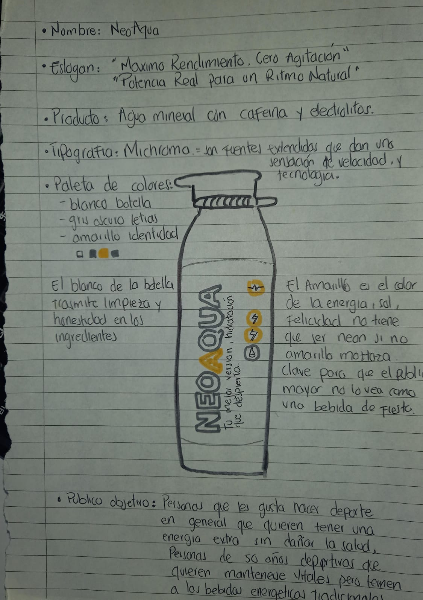
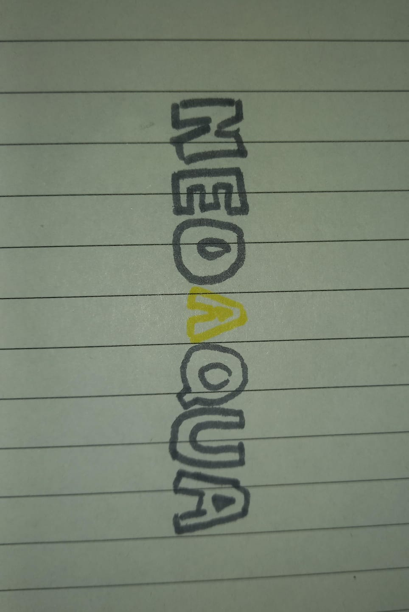
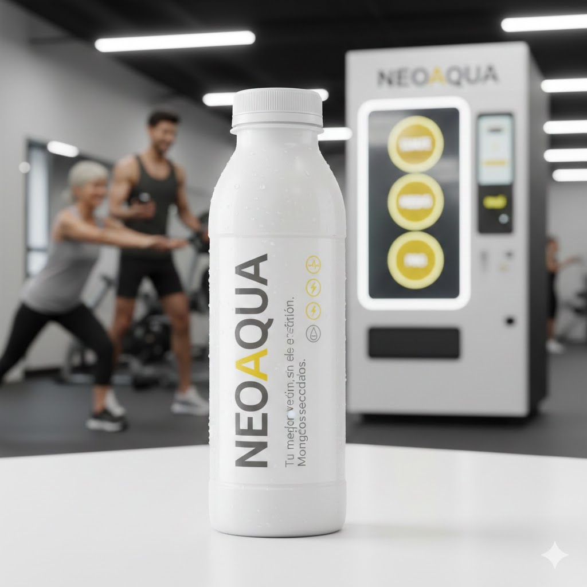

# 💧 NeoAqua: Vitalidad Bajo Control
🚀 El Producto Soy Yo (Marca Personal)
NeoAqua no es solo una bebida; es una filosofía de trabajo convertida en producto. En el contexto de DOWS, representa a un profesional capaz de entregar soluciones de alto impacto que son, al mismo tiempo, seguras, estables y centradas en el bienestar del usuario final.

Eslogan: "Tu mejor versión, sin efectos secundarios."

🎯 Perfil de Producto y Público Objetivo
El Problema
Las bebidas energéticas actuales son agresivas, llenas de químicos y percibidas como "peligrosas" por personas que cuidan su salud cardiovascular o mayores de 50 años.

La Solución
Una bebida híbrida: Agua Premium + Electrolitos + Cafeína Orgánica.
NeoAqua ofrece un "boost" de energía limpia que no altera el ritmo cardíaco, permitiendo que deportistas de todas las edades (especialmente el segmento Senior 50+) se mantengan activos con total seguridad.

Público Objetivo:

Atletas Senior (50+): Personas que buscan vitalidad pero temen a las taquicardias.

Deportistas de Rendimiento "Clean": Usuarios que evitan el azúcar y los colorantes.

Tech Workers: Profesionales que necesitan enfoque mental sin el "crash" del café.

🎨 Identidad Visual 
🖋️ Tipografía: Michroma
Por qué: Es una fuente geométrica y tecnológica. Transmite orden, estructura y futuro. Sus formas anchas aseguran legibilidad para todos los rangos de edad.

Color
Blanco Glaciar : Honestidad, pureza y transparencia en los ingredientes
Amarillo Mostaza : Energía vital, madurez y optimismo controlado.
Gris Carbón : Seriedad profesional, contraste y elegancia.

Elementos de Diseño
Envase: Botella blanca mate (minimalista) con tipografía vertical.

Iconografía: ⚡ (Energía), ❤️ (Salud), 💧 (Hidratación).

Interfaz de Usuario (UX): Máquinas expendedoras con botones grandes y simplificados para facilitar el acceso a personas mayores.

# imagen representada por la IA apartir de mis bocetos : 
