# Bitácora de Desarrollo: Semana 3 - Patrones de Diseño
Este repositorio contiene la implementación práctica de 11 Patrones de Diseño fundamentales (Creacionales, Estructurales y de Comportamiento) aplicados a casos de estudio del mundo real.

🛠 Patrones Creacionales
Se enfocan en los mecanismos de creación de objetos, aumentando la flexibilidad y la reutilización del código.

1. Factory Method (Logística de Transporte)
   Define una interfaz para crear un objeto, pero deja que las subclases decidan qué clase instanciar.

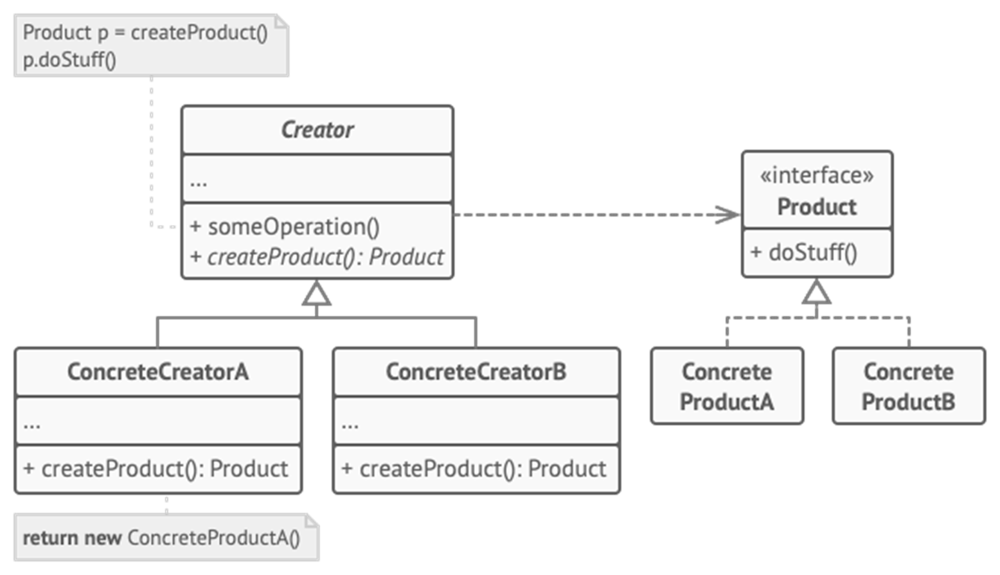

2. Abstract Factory (Ecosistema de Consolas)
   Proporciona una interfaz para crear familias de objetos relacionados (Mando, Juego, UI) sin especificar sus clases concretas.

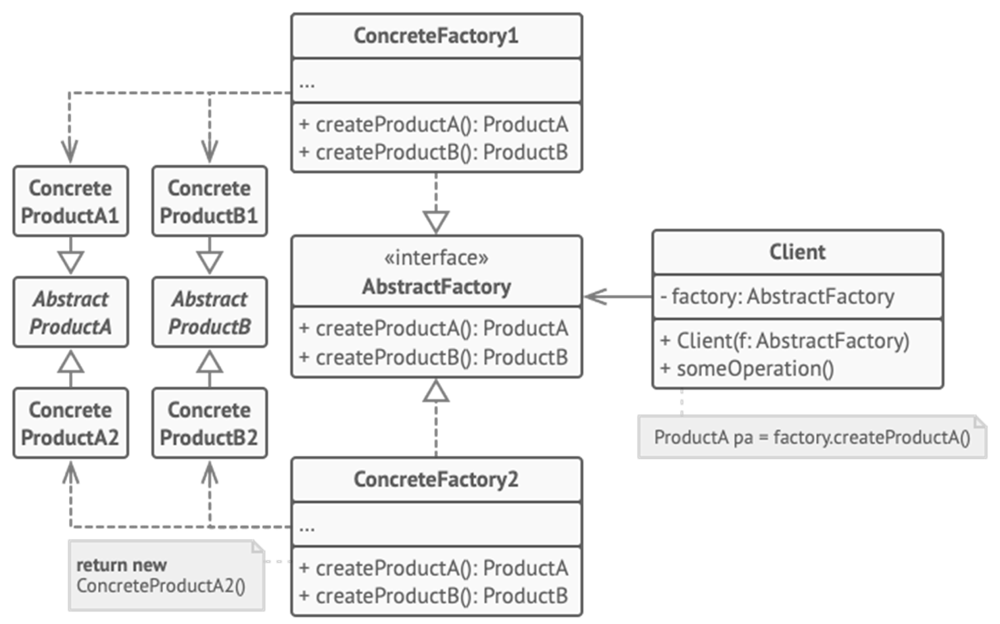

3. Builder (Fábrica de Juguetes)
   Separa la construcción de un objeto complejo de su representación, permitiendo que el mismo proceso de construcción cree diferentes representaciones.

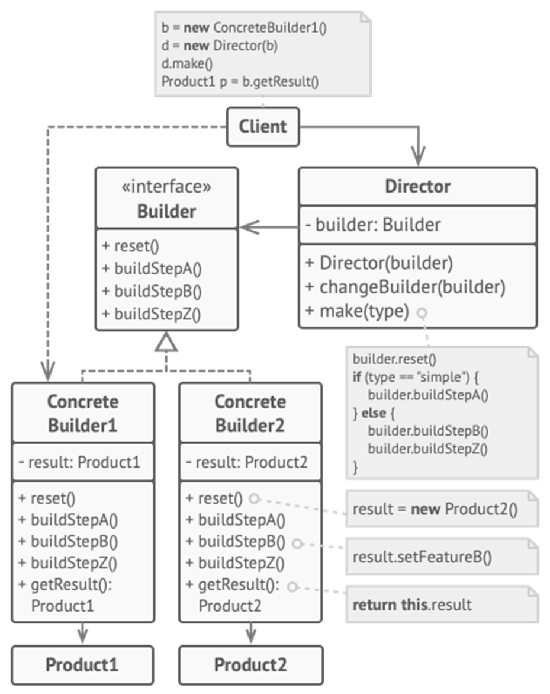

🏗️ Patrones Estructurales
Exploran cómo ensamblar objetos y clases en estructuras más grandes, manteniendo la eficiencia y flexibilidad.

4. Adapter (Gasolinería Inteligente)
   Permite que interfaces incompatibles trabajen juntas (Convertir Litros a KWh).

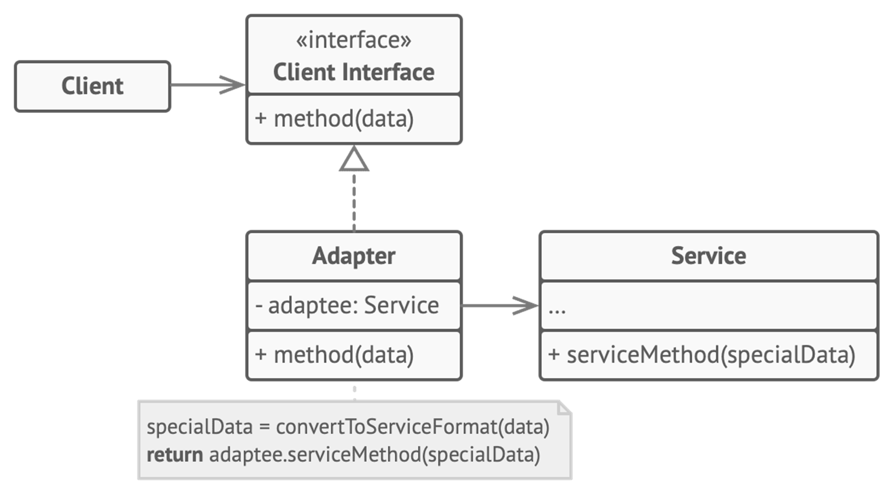

5. Bridge (Formas y Colores)
   Desacopla una abstracción de su implementación para que ambas puedan variar independientemente, evitando la explosión combinatoria de clases.

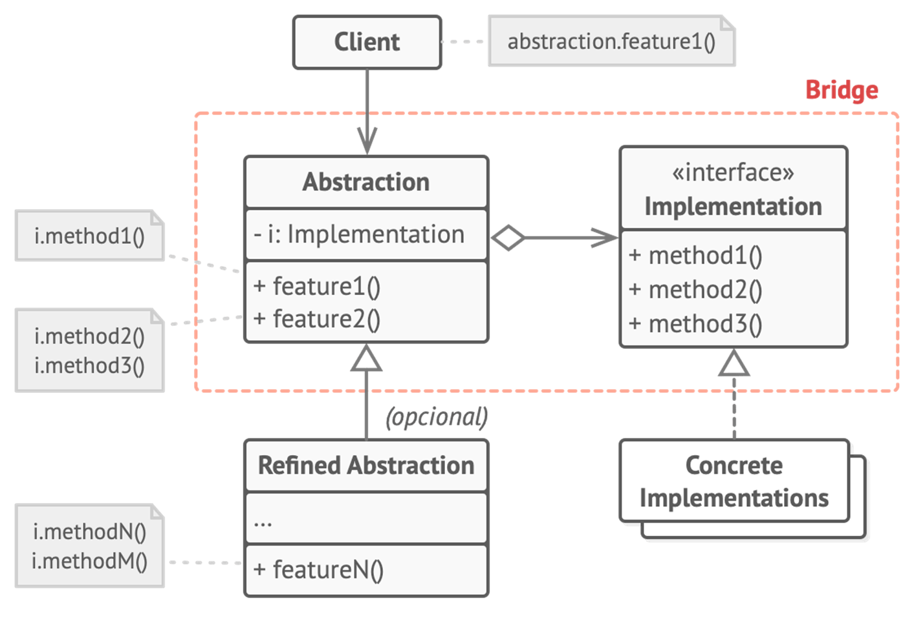

6. Composite (Sistema de Bodega)
   Permite tratar objetos individuales (Productos) y composiciones de objetos (Cajas) de manera uniforme.

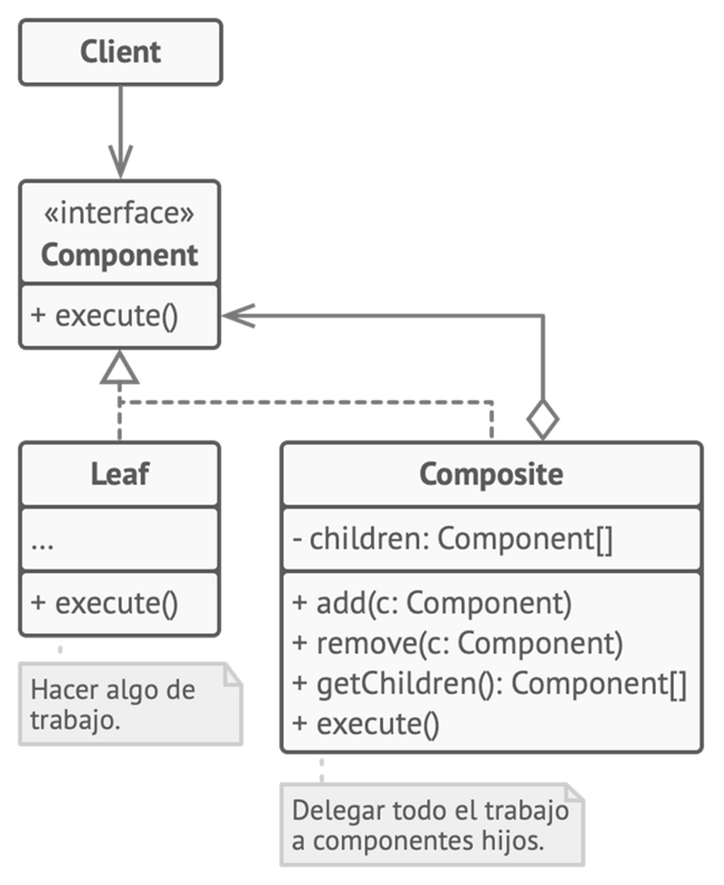

7. Decorator (Simulador Naval)
   Añade responsabilidades a objetos dinámicamente (Mejoras de barcos) sin usar herencia.

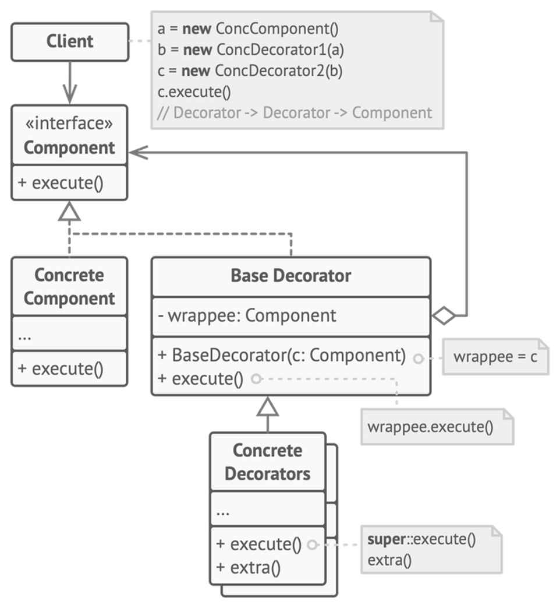

 Patrones de Comportamiento
Se encargan de la comunicación efectiva y la asignación de responsabilidades entre objetos.

8. Chain of Responsibility (Control Migratorio)
   Pasa las solicitudes a lo largo de una cadena de manejadores hasta que uno de ellos la procesa.

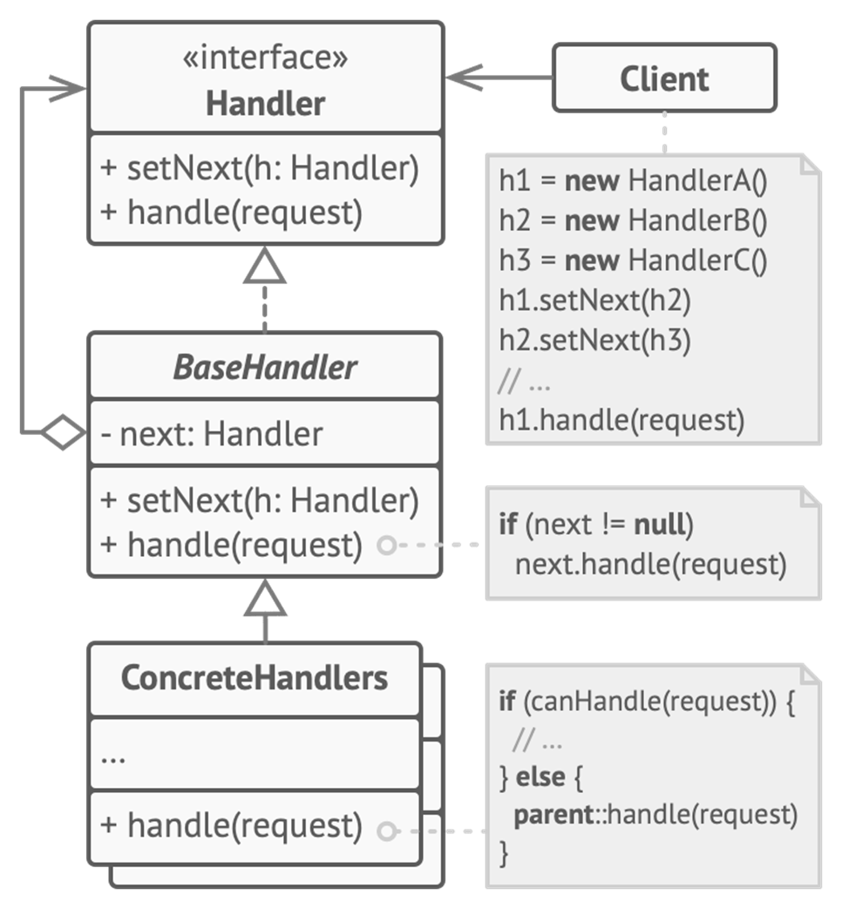

9. Command (Controles de Videojuego)
   Encapsula una petición como un objeto, permitiendo parametrizar clientes con diferentes peticiones.

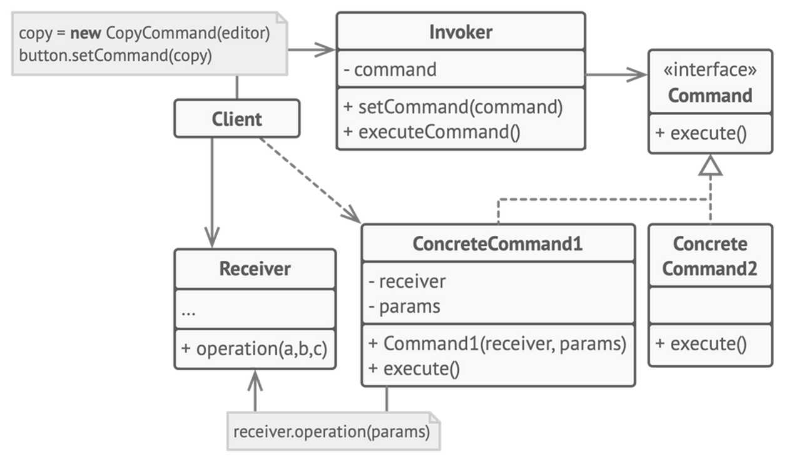

10. Iterator (Tour Turístico en Roma)
    Proporciona una forma de acceder secuencialmente a los elementos de un objeto agregado sin exponer su representación subyacente.

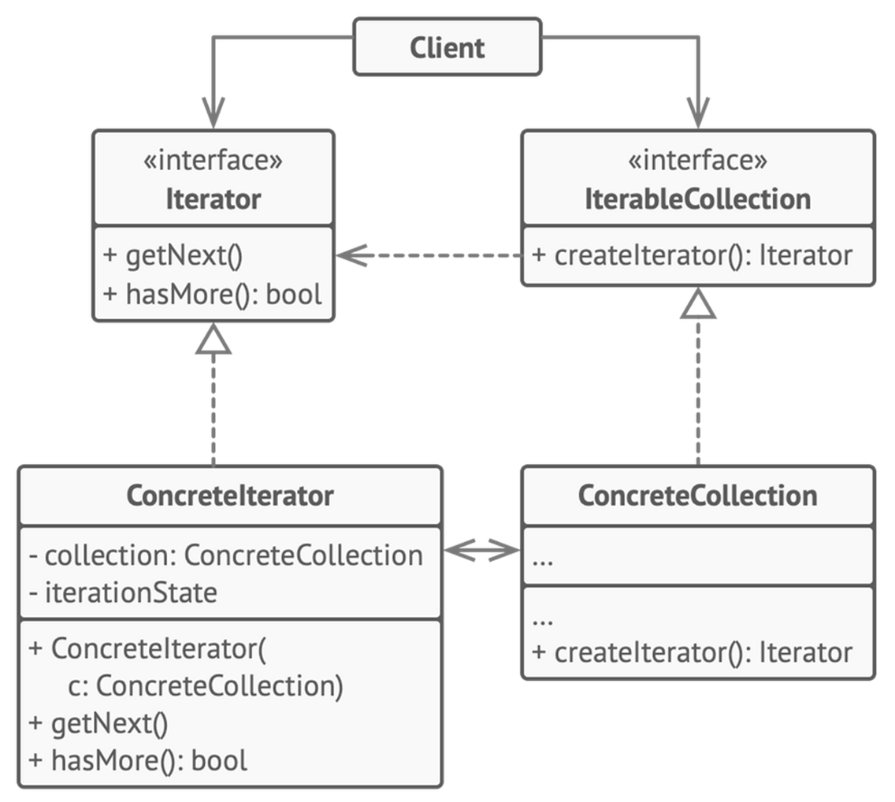

11. Strategy (Navegador GPS)
    Define una familia de algoritmos, encapsula cada uno y los hace intercambiables en tiempo de ejecución.

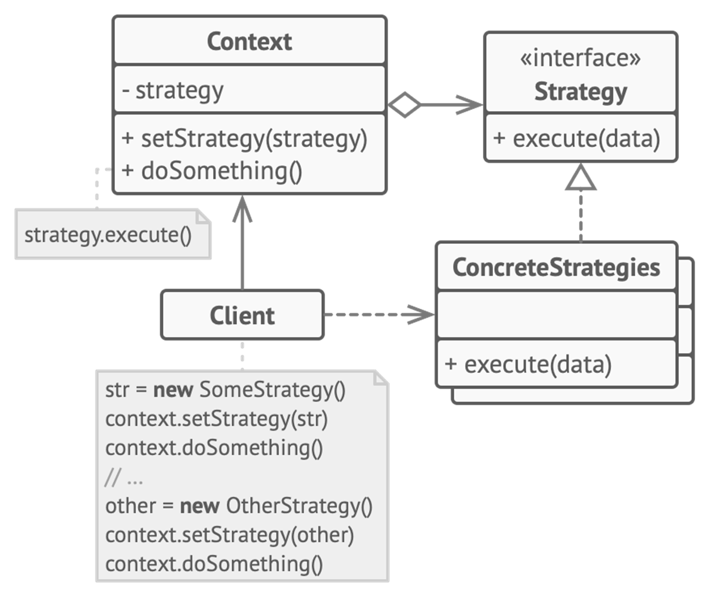

¿Qué entendía mal antes?

Pensaba que para cada pequeña variante de un objeto debía crear una nueva clase (herencia infinita), lo que hacía que mi código fuera rígido y difícil de mantener (como en el ejercicio de las formas y colores o los barcos).

Me confundía la diferencia entre una Clase y una Interfaz, a veces intentando poner lógica de implementación dentro de un contrato que debía ser solo declarativo.

No tenía claro que se podía cambiar el comportamiento de un objeto en tiempo de ejecución sin modificar su código original.

¿Qué entiendo ahora?
Entiendo que la Composición suele ser mejor que la Herencia para evitar la explosión de clases (Patrón Bridge y Decorator).

Comprendo que los Patrones de Diseño no son reglas rígidas, sino soluciones probadas a problemas comunes que ayudan a cumplir con los principios SOLID.

Ahora sé cómo desacoplar el "qué se hace" del "cómo se hace" usando interfaces y estrategias (Patrón Strategy y Command).

Entiendo la importancia de separar la creación de objetos complejos del objeto en sí para mantener el código limpio (Patrón Builder y Factory).

¿Qué me falta reforzar?
Debo practicar más la identificación rápida de qué patrón aplicar ante un problema nuevo antes de empezar a escribir código.